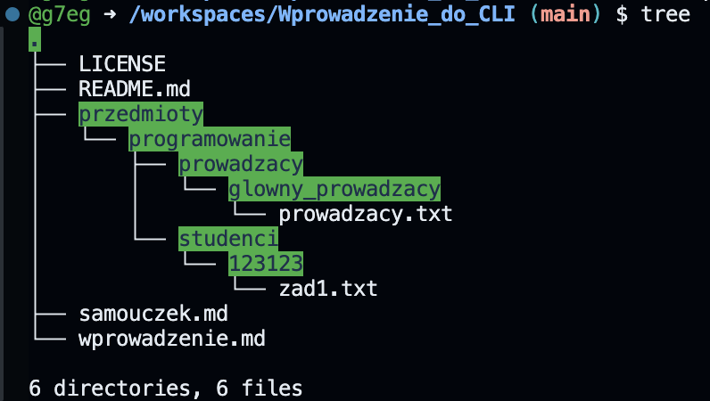
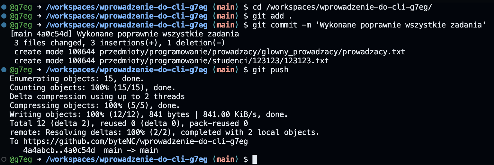

[Wróć do wprowadzenie](./wprowadzenie.md)

# Samouczek

## Słowem wstępu

Poniżej zostały opisane czynności, które należy wykonać jeden po drugim w celu przejścia całego samouczka. Pominięcie którejś z operacji może spowodować niezamierzony efekt lub któryś z kolejnych kroków nie będzie możliwy do wykonania o czym zostaniemy poinformowani stosowynm komentarzem w terminalu.

Z powyższego akapitu należy wyciągnąć następujące wnioski:

-   Czynności które należy wykonać muszą być wykonane w ściśle określonej kolejności np. nie da się usunąć danego pliku jeżeli on nie istanieje,
-   Jeżeli spróbujemy wykonać polecenie, które jest niepoprawne efektem będzie stosowny kompunikat błędu. np. wywołanie polecenia sd które nieistnieje 'bash: sd: command not found',
-   Nieczytanie błędów nie zwalania nas z myślenia. Jeżeli uzyskujesz jakikolwiek błąd lub coś nie działa, zastanów się co może być przyczyną. Podpowiem że komunikat błędu zazwyczaj wskazuje na przyczynę tego, dlaczego coś nie działa.

---

## Zadanie 1

Zapamiętaj że wszystkie operacja które bedziemy wykonywać robimy w katalogu domyślnym (_workspaces/wprowadzenie-do-cli-[userName]_) u mnie jest to: _/workspaces/wprowadzenie-do-cli-g7eg_. Dlatego też przed uruchomieniem polecenia upewnij się że przed (po lewej stronie) znakiem zachęty _$_ znajduje się freagment ścieżki _workspaces/wprowadzenie-do-cli-g7eg_.

Pamięteż że w każdej chwilii możesz sprawdzić ścieżkę do akutalnego katalogu gdzie sie znajdujesz, wykonując polecenie _pwd_.

Jeżeli wpiszesz przez przypadek polecenie _cd_ bez podania jakiejkolwiek ścieżki i przeniesie Cię do katalogu głównego naszego systemu, nie przejmuj się tym. Możesz wrócić do poprzedniego katalogu wykonując polecenie '_cd -_' lub _cd /workspaces/wprowadzenie-do-cli-[userName]_.

Dla pewności przed rozpoczęciem pracy wykonaj polecenie:

```bash
cd /workspaces/wprowadzenie-do-cli-[userName]
```

### UWAGA! Jeżeli czytając treść polecenia uznasz że jest to na chwilę obecną zbyt trudne i i nie ogarniasz tego tematu, nie przejmuj się tylko zernij do podpowidzi które znajdują się poniżej treści zadania (ps. trzeba kliknąć w strzełeczkę aby się pojawiły 😉.

---

Krok 1. W katalogu domyślnym (_workspaces/wprowadzenie-do-cli-[userName]_) gdzie obecnie powinieneś się znajować, utwórz katalog nazywający się:

-   _przedmioty_

wewnątrz tego katalogu utwórz kolejny katalog nazwywający się:

-   _programowanie_

wewnątrz niego utwórz dwa katalogi:

-   _prowadzacy_ \*(unikaj PL nazków w nazwach katalogów oraz plików)
-   _studenci_

wewnątrz katalogu _prowadzacy_ utwórz katalog:

-   _glowny_prowadzacy_

wewnątrz katalogu _glowny_prowadzacy_ utwórz plik:

-   _prowadzacy.txt_

Wpisz w pliku tylko imię osoby, którą chciałbyś widzieć w roli prowadzącego kurs z programowania i zapisz zmiany.

Wewnątrz katalogu studenci utwórz katalog z własnym nr indeksu np:

-   _123123_ \*(podaj swój nr indeksu)

Krok 2. Wróć do katalogu _przedmioty_. Wyświetl strukturę katalogów.

Krok 3. Zweryfikuj czy wszystko się zgadza zogdnie z Krok 1 - czyli katalog _programowanie_ znajduje się w katalogu _przedmioty_, katalogi _prowadzacy_ oraz _studenci_ są wewnątrz _programowanie_, a katalog z Twoim nr indeksu jest wewnątrz katalogu _studenci_. Jeżeli nie dokonaj stosownych poprawek (usun katalogi i utwórz je jeszcze raz).

Krok 4. Przejdź do katalogu studenci a następnie do katalogu z Twoim nr indeku (no chyba że wiesz jak zrobić to bez przechodzenia tam? To zrób bez przechodzenia w to mejsce) i utwórz w nim plik o nazwie _zad1.txt_. Upewnij się że plik nazywa się poprawnie!
Wpisz w nim swój ulubiony cytat z filmu, książki czy piosenki .

Zapisz zmianę i zakmnik plik.

Jeżeli wykonałeś wszystkie czynności po kolei i zogdnie z treścią polecenia, to rezultat może być tylko jeden.
Przejść do kolejnego podpunktu samouczka: 'Test zadania 1'.

Jeżeli na tym etapie nie wiesz jak wykonać poszczególne kroki poniżej znajdują się podpowiedzi. W dalszych etapach samouczka podpowiedzi będą mniej szczegółowe.

Klikając na strzełeczkę rozwiniesz listę z podpowiedziami.

<details>
  <summary><p style="color:#FF0000">Podpowiedź</p></summary>

0. Wykorzystaj polecenie w celu upewnienia się że jesteś we właściwym katalgu

```bash
pwd
```

jeżeli zwóciona ścieżka to _workspaces/wprowadzenie-do-cli-[userName]_ znaczy ze jesteś w odpowiednim miejscu.
Jeżeli nie to wróć do tego katalogu wpisując:

```bash
cd /workspaces/wprowadzenie-do-cli-[userName]
```

1. Wykorzystaj polecenie :

```bash
mkdir przedmiot
```

2. Przejdź do katalogu przedmiot za pomocą:

```bash
cd przedmiot
```

3. Wykorzystaj polecenie:

```bash
ls
```

Aby upewnić się że w katalogu nie ma jeszcze każdnych plików.

4. Wykorzystaj polecenie:

```bash
mkdir programowanie
```

5. Wykorzystaj polecenie:

```bash
cd programowanie
```

6. Wykorzystaj polecenie:

```bash
ls
```

Aby upewnić się że w katalogu nie ma jeszcze każdnych plików.

7. Wykorzystaj polecenie

```bash
mkdir prowadzacy
```

8. Wykorzystaj polecenie:

```bash
ls
```
Aby upewnić się że w katalogu nie ma jeszcze każdnych plików.

9. Wykorzystaj polecenie:

```bash
cd prowadzacy
```

10. Wykorzystaj polecenie

```bash
mkdir glowny_prowadzacy
```
11. Wykorzystaj polecenie:

```bash
cd glowny_prowadzacy
```
12. Wykorzystaj polecenie

```bash
code prowadzacy.txt
```
Wpisz w pliku treść zgodnie z poleceniem i zapisz zmiany.

13. Wróć do katalogu _programowanie_.
Wykorzystaj w tym celu polecenie:
```bash
cd ..
```
Powtórz je tyle razy ile jest to konieczne.

Utwórz katalog _studenci_ znajdujący się w tym samym katalogu co _prowadzacy_ (czyli wewnątrz katalogi _programowanie_).

14. Wykorzystaj polecenie

```bash
mkdir studenci
```

15. Wykorzystaj polecenie:

```bash
ls
```

Aby upewnić się że w katalogu zostały utworzone dwa nowe katalogi.

16. Przejdź do katalogu studenci za pomocą

```bash
cd studenci
```

17. Wykorzystaj polecenie gdzie zamiast 123123 podaj wlasny nr indeksu

```bash
mkdir 123123
```

18. Wróć do katalogu __workspaces/wprowadzenie-do-cli-[userName]_

```bash
cd /workspaces/wprowadzenie-do-cli-[userName]
```

19. Wykorzystaj polecenie

```bash
tree
```

20. Wykorzystaj polecenie

```bash
cd /przedmiot/programowanie/studenci/123123
```

21. Wykorzystaj polecenie

```bash
code zad1.txt
```
22. Wpisz w oknie edycji pliku treśći zapisz zmiany. Przydatnym do tego celu jest skrót klawiszowy Ctrl + S.

Po poprawnym wykonaniu wsztstkich poleceń powinieneś uzyskać następującą strukturę plików:


</details>

## Test zadania 1

W celu weryfikacji czy wykonałeś zadanie 1 poprawnie należy wykonać polecenie.

Najpier wykonaj:

```bash
cd /workspaces/wprowadzenie-do-cli-[userName]
```

,a następnie:

```bash
check_z1
```

Wynik weryfikacji uzyskasz w formie raportu wyświetlonego w terminalu.

---

### Do realizacji zadania nr 2 wymagane jest poprawne wykonanie zadania 1. Jeżeli test zadaia 1 zwrócił informację że coś jest NOK (not ok). Wróć do tego miejsca i dokonaj stosownych poprawek. Nie wiesz gdzie zacząć? Zacznij od początku i sprawdź poszczególne etapy po kolei.

---

## Zadanie 2
Kolejne zadanie nie będzie mieć już tak mocno rozbudowanych podpowiedzi. W związkuz tym przypominam że w każdej chwilii możesz otworzyć _wprowadznie.md_ gdzie opisane zostały wszystkie niezbędne polecenia wraz z przykładami.

---
Krok 1. Wykonaj poprawnie zadanie 1.

Krok 2. Otwórz ponownie plik _zad1.txt_ w katalogu z Twoim nr indesku. Zweryfikuj czy w pliku znajdują się takie same informaje jak te, które umieściłeś w ramach Zadania 1.
Jeżeli tak, super. Możesz zamknąć plik i przejść do kolejnogo kroku. Jeżli nie, możliwe że pominąłeś któryś z koroków.I nie zapominałeś przetestować zadanie 1, w takim wypadku odsyłam do akapitu _Test zadania 1_.

Krok 3. W katalogu domyślnym (_workspaces/wprowadzenie-do-cli-[userName]_) gdzie znajduje się katalog _przedmioty_ utwórz nowy katalog o nazwie _backups_ .

Krok 4. W katalogu _backup_ uwtórz katalog _v1_.

Krok 5. Wykonaj kopię katalogu _przedmioty_ wraz z jego zawartością do katalogu: _backup/v1_.

Innymi słowy:
W utworzonym katalogu _v1_ ma znaleźć się kopia katalogu _przedmioty_ wraz z całą zawartością.

Krok 6. Sprawdź poprawność wykonania polecenia.
W tym celu przejdź do główenego katalogu.
```bash
cd /workspaces/wprowadznie-do-cli-g7eg
```
a następnie wykonaj polecenie:
```bash
check_z2
```

## Przesłanie zadań do oceny

Jeżeli przetestowałeś __wszystkie__ zadania lokanie w Twoim Workspace, możesz przesłać je do oceny.

W tym celu musimy wykonać kilka poleceń wykonujących operacje na naszym repozytorium. W tym celu wykorzystujemy system kontroli wersji GIT (nie mylić z github.com ponieważ GIT jest instalowany lokalnie - jak praktycznie każdy program, natomiast github.com to w bardzo dużym uproszczeniu platforma z repozytoriami wspierająca GIT'a).


UWAGA! Przed przesłaniem zadań należy je przetestować lokalnie za pomocą dedykowanych poleceń [check_z1, check_z2, check_z3]. Testy lokalne można uruchamiać nieokreślona ilość razy. Przesłać prace można natomiast jeden raz.

Krok 1. Przejście do głównego katalogu - zauważ że [userName] to nazwa użytkownika.

```bash
cd /workspaces/wprowadzenie-do-cli-[userName]
```
u mnie wygląda to tak:
```bash
cd /workspaces/wprowadznie-do-cli-g7eg
```

Krok 2. Dodanie utworzonego katalogu _przedomoty_ wraz z zawartością do systemu kontroli wersji GIT. 
```bash
git add .
```
**Ta kropka w poleceniu jest bardzo ważna.**

Krok 3. Dodanie commita wraz z komentarzem. Commit to nic innego jak zatwierdzenie dokonanych zmian. Można to utożsamiać z "stopklatką" wykonaną na naszym projecie, do której możemy w dowolnym momencie powrócić.

W cudzysłowiu podajemy komentarz, który w jasny sposób powinien informować jakie zmiany zostały dokonane w tym commicie.

Wykonaj następujące polecenie:

```bash
git commit -m 'Wykonane poprawnie wszystkie zadania'
```
Po uruchomieniu tego polecenia, otrzymamy informację z podsumowaniem z id commita oraz co zostało zapisane w commicie.

```code
[main 184629d] Rozwiazane zadania
 2 files changed, 2 insertions(+)
 create mode 100644 przedmioty/programowanie/prowadzacy/glowny_prowadzacy/prowadzacy.txt
 create mode 100644 przedmioty/programowanie/studenci/123123/123123.txt
 ```


Krok 4. Przesłanie zmian na serwer.
Jeżli polecenie z commitem zostało wykonane poprawnie, teraz musimy przesłać zmiany na serwer github. W tym celu wykonujemy następujące polecenie:

```bash
git push
```

W odpowiedzi zwrotnej uzyskamy informacje o postępie wykonywanych operacji.

Nasza praca została przesłana na serwer, zostanie teraz automatycznie poddana sprawdzeniu.

<!-- Poniżej screen jak powinno wyglądać wywołanie poszczególnych poleceń: -->

<!--  -->


Przechodząc na adres repozytorium możemy spradzić czy nasza praca przeszła wszystkie testy pozytywnie.
W tym celu należy przejsć do zakładki Actions.
