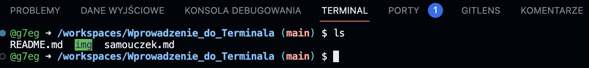
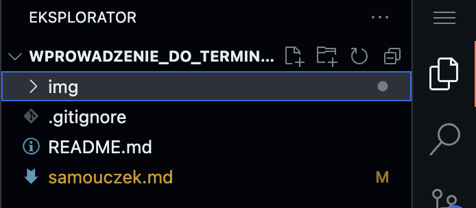

# Terminal samouczek
Poniżej zostały opisane czynności, które należy wykonać jeden po drugim w celu przejścia całego samouczka. Pominięcie którejś z operacji może spowodować niezamierzony efekt lub któryś z kolejnych kroków nie będzie możliwy do wykonania o czym zostaniemy poinformowani stosowynm komentarzem w terminalu.


## Uruchomienie i konfiguracja środowiska:
Na samym początku nalezy uruchomić środowisko Codespace logując się przy tym na swoje konto GitHub.

Po jego uruchmieniu upewnij się ze w dolnej części okna przeglądarki znajduje się Terminal.


Jezeli go nie widzisz z menu wybierz ikonę <b> ≡ (ikona menu hamburgera)</b>  -> następnie terminal -> nowy terminal.

Powinieneś zauwazyc w oknie terminalu coś podobnego do:
```cmd
@nazwaUżytkownika -> /workspaces/aktualna_ścieżka/ (gałąź repozytowrium) $
```
Przykładowy zrzut ekranu z terminalu:


Oznacza to że wszystko zostało uruchomione poprawnie i możemy przystąpić do dalszej pracy!

# Podstawowe polecenia bash - wprowadzenie
Tutaj opisanych zostało kilka podstawowych poleceń, które są niezbędnę do poruszania się po katalogach i plikach na naszym komputerze oraz wykonywania podstawowych operacji na nich.

## ls - wyświetl zawartość katalogu
ls - list. Wpisanie tego polecenia w takiej formie:
```bash
ls
```
Wyświetli nam listę elementów znadujących się w katalogu w którym się obecnie znajdujemy.


Te same informacje możesz znaleźć w GUI - eksploratorze plików.



Polecenie ls możemy wywołac jeszcze z pewnymi parametrami.
Najważniejszymi i naczęściej wykorzystywanymi są:

```bash
ls -a
```
Pozwala wyświetlić wszystkie ukryte pliki w katalogu.


```bash
ls -l
```
Pozwala wyświetlić listę plików z bardziej szczegółowym opisem.


## cd - przejdź do katalogu
change directory - Pozwala przejść do katalogu.
Podajemy polecenie cd a następnie folder do którego chcemy przejść.
```bash
cd example
```
W przykładze wywołano wczesniej ls w celu wylistowania dostępnych plików i katalogów. Następnie podano polcenie zmiany katalogu cd i nazwę katalogu.

#### TIP!
___
Podczas wpisywania np nazwy katalogu nie musisz wpisać jej w całości. Wystarczy że wpiszesz pierwszą literę katalogu i naciśniesz klawisz TAB (tabulator). Terminal sam uzupełni nazwę katalogu. Jeżeli katalogów jest więcej spełniających to kryterium (zaczynają się na 'e'), terminal wświetli ponownie listę katalogów które spałniają to kryterium, podając kolejna literę i ponownie wciskając klawisz TAB nazwa zostanie uzupełniona automatycznie.

Wiemy już jakprzechodzić z katalogu do kolejnego katalogu.
Natomiast co jeżeli popełnimy błąd i chcemy powrócić do wcześneijszego katalogu?
W takiej sytuacji możemy wykorzystać również polcenie cd ale z dwoma znakmami '..'
```bash
cd ..
```
Zauważ że w przykładzie poniżej przed wywołaniem polcenie '*cd ..*' znajdowaliśmy się w katalogu example.
Po wywołaniu wróciliśmy do poprzedniego katalogu.


## pwd - wyświetl ścieżkę do obecnego katalogu
## mkdir - utwórz nowy katalog
## mv - przenieś plik
## rm - usuń plik lub katalog
## clear - wyczyść okno terminalu
# Dodatkowe komendy

## code - otwiera edycję pliku w VSCode - jeśtli jest zainstalowny
