[Wróć do README](./README.md)

___
# 🔵 Wprowadzenie do poleceń - bash
Poniżej zostały opisane polecenie pozwalające w postawowym zakresie dokonać operacji na plikach i katalogach za pomocą CLI.


## Zanim rozpoczniemy pracę:

### Pierwsze uruchomienie GitHub Codespaces:

Prowadzący udostępni link który prowadzi do Classroom w ramach którego będziesz wykonywać poszczególne zadania. Classroom to nic innego jak wirtualna klasa na platformie GitHub.

Aby dołączyć do Classroom musisz kliknąć w udostępniony przez prowadzącego link, a następnie zalogować się do swojego konta na GitHub jeżeli nie logowałeś się wcześniej, a teraz jest to wymagane.

Zaczekaj chwilę zgodnie z poleceniem wyśiwetlonym na ekranie, a następnie odśwież stronę. W tym czasie zostanie utworzone na Twoim koncie repozytorium bazujące na template który został opracowany.


Po odświeżeniu strony powinien ukazać Ci się następujęcy komunikat:
<!--  -->
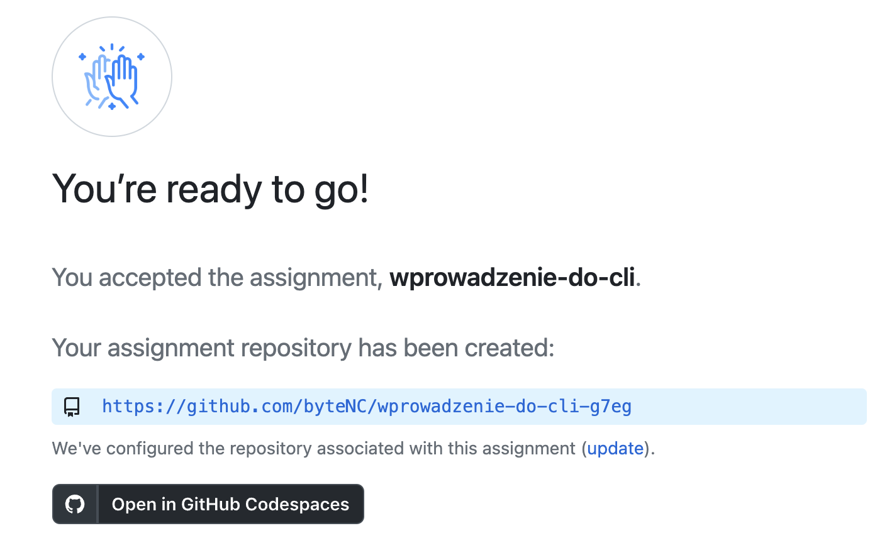

Możesz przystąpić do pracy klikając przycisk z napisame [Open in GitHub Codespaces].

Po załadowaniu się całego środowiska możesz przystąpić do pracy.

[!IMPORTANT] Pierwsze uruchomienie może zająć dłuższą chwilę. Uzbrój się w cierpliwość. Jeżeli jednak uznasz że trwa to zbyt długo, odśwież stronę w przeglądarce.

### Ponowne uruchmienie GitHub Codespaces:
Link który został udstępniony przez prowadzacego służył jedynie do dołączenia do Classroom. Tearz gdy jesteś już w odpowiednim Classrom możesz otworzyć swoje repozytorium z panelu użytnowkia.
W tym celu zaloguj się na swoje konto w github.com
Następnie po lewiej stronie w seksji "Top Repositories" odnajdź pozycję:
"byteNC/wprowadzenie-do-cli-[UserName]" i kliknij na nią.
<!--  -->
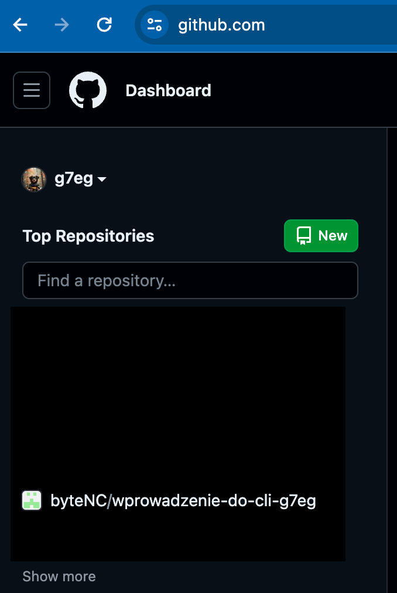

Po przekierowaniu do repozytorium należy uruchomić środowisko Codespaces w tym celu kliknij w zielony przycisk <> Code, a następnie wybierając zakładkę Codespaces. Jeżli utworzyłeś wcześniej Codespaces podczas dołączania przez link udostępniony przez prowadzacego dostępny Codespaces powinien pojawić się na liście jak na załączonym poniżej screeenie (special memory):

<!-- 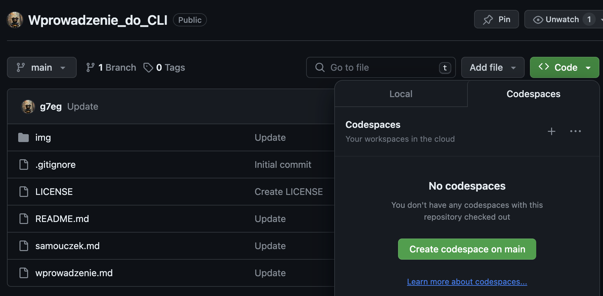 -->
<!--  -->


W przeciwnym wypadku pojawi się puste okienko z informacją o możliwości utworzenia Codespace on main. Należy kliknąć na ten przycisk i zaczekać do całkowitego załadowania się środiwiska.


[!WARNING] Ilość Codespaces które można utworzyć każdy z uczestników kursu jest ograniczona. Nie zdziw się więc jeżeli uzyskasz informację że osiągnąłeś już max ilość Codespace do utworzenia. Należy wtedy usunąć niewykorzystywane Codespace i utworzyć nowe lub wykorzystać istniejące.

### Uruchomione środowisko - co dalej:

Po jego uruchmieniu upewnij się że w dolnej części okna przeglądarki znajduje się Terminal.

Jeżeli go nie widzisz z menu wybierz ikonę <b> ≡ (ikona menu hamburgera)</b> -> terminal -> nowy terminal.

Powinieneś zauważyć w oknie terminalu który otowrzy się w dolnej części ekranu, coś podobnego do:

<!-- 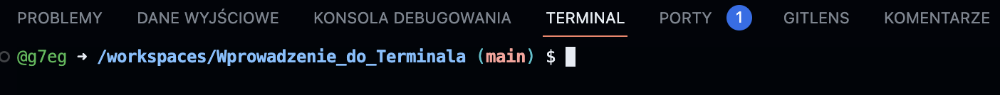
lub 
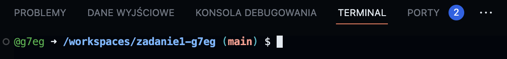 -->
<!--  -->
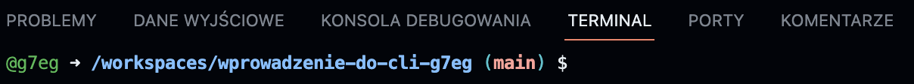

Najważniejszy w tym wszystkim jest znak '$' nazywany znakiem zachęty.

Wszystkie polecenia będzie wpisywać po znaku zachęty.

Oznacza to że wszystko zostało uruchomione poprawnie i możemy przystąpić do dalszej pracy!


# 🟢 Podstawowe polecenia bash - wprowadzenie
Tutaj opisanych zostało kilka podstawowych poleceń, które są niezbędnę do poruszania się po katalogach i plikach na naszym komputerze oraz wykonywania podstawowych operacji na nich. Tak zdaję sobie sprawę że jesteś przyzyczajony do pracy z GUI i najchętniej zamknął byś to wszystko i [...]. 

Jednak pocieszę Cię, bo nie jesteś jedyną osobą, która na poczatku przygody z CLI miała takie odczucia. Najtrudniejsze jest zmiana swojego negatywnego nastawienia i przełamenie przekonań że to trudne. Zobaczysz że wraz z praktyką przyjdzie satysfakcja!

# Zacznimy więc od czegoś prostego i jednocześnie przydatnego.

## ls - wyświetl zawartość katalogu
ls - list. Wpisanie tego polecenia w takiej formie:
```bash
ls
```
Wyświetli nam listę elementów znadujących się w katalogu w którym się obecnie znajdujemy.


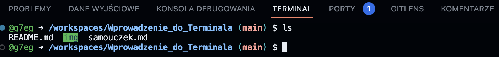

Te same informacje możesz znaleźć w GUI - eksploratorze plików. 

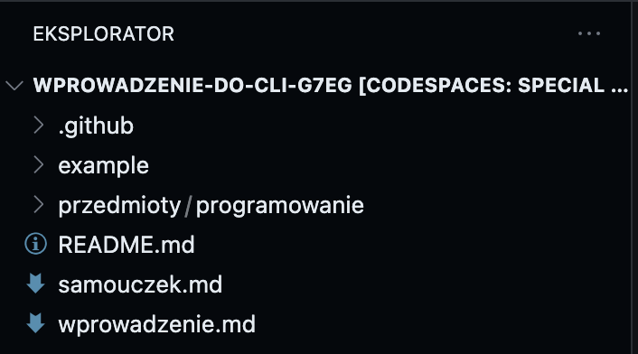

Jednak o GUI na chwilę zapominamy. 

Ilość elementów wyświetlonych u Ciebie może się różnić względem tego co widzisz na screenach. Wynika to z tego że jestem w trakcie opracowywania specjalnie dla Ciebie tych właśnie materiałów.

Polecenie ls możemy wywołac jeszcze z pewnymi parametrami.
Parametry to dołączone w tej samej linii (po głównej komendzie) symbole, zazwyczaj zaczynają się od znaku '-'.

Najważniejszymi i naczęściej wykorzystywanymi są:

```bash
ls -a
```
Pozwala wyświetlić wszystkie ukryte pliki w katalogu.

<!-- 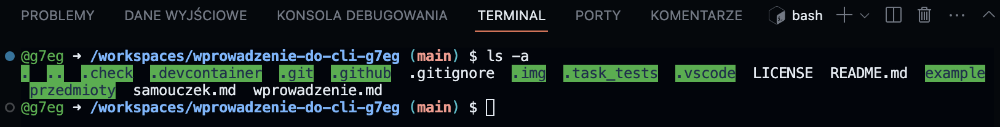 -->


```bash
ls -l
```
Pozwala wyświetlić listę plików z bardziej szczegółowym opisem.

<!-- 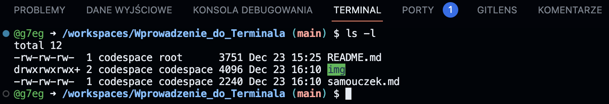 -->


Zazwyczaj polecenia posiadają wiele parametrów zmieniających lub rozszerzajacych działanie danego polecenia. Wypisując je wszystkie tutaj, miał byś sporo lektury do przeczytania i zapewne pominął byś to. Warto więc zgłębić tą wiedzę samodzielnie.

## cd - przejdź do katalogu
change directory - Pozwala przejść do katalogu.
Podajemy polecenie cd a następnie folder do którego chcemy przejść.
```bash
cd example
```
W przykładze wywołano wczesniej ls w celu wylistowania dostępnych plików i katalogów. Następnie podano polcenie zmiany katalogu cd i nazwę katalogu.

<!-- 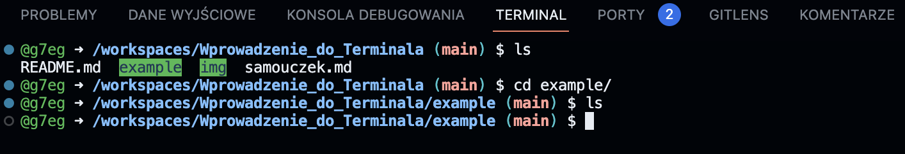 -->

### Powrót do porzedniego katalogu
Jeżeli pomyślisz się i będzies chciał powrócic do poprzedniego katalogu, a jego ściezka jest skomplikowana. Możesz wykorzystać polecenie:
```bash
cd -
```
Spowoduje to przeniesienie do poprzedniego katalogu z którzego 'przyszedłeś'.

### TIP!
___
Podczas wpisywania np nazwy katalogu nie musisz wpisać jej w całości. Wystarczy że wpiszesz pierwszą literę katalogu (np. e jak katalog example) i naciśniesz klawisz TAB (tabulator). Terminal sam uzupełni nazwę katalogu. 

Jeżeli katalogów jest więcej zaczynających swją nazwę od 'e', terminal wświetli ponownie listę katalogów, które spałniają to kryterium. Wprowadzając kolejną literę i ponownie wciskając klawisz TAB nazwa zostanie uzupełniona automatycznie.

___

Wiemy już jak przechodzić z katalogu do kolejnego katalogu.
Natomiast co jeżeli popełnimy błąd i chcemy powrócić do wcześneijszego katalogu?

W takiej sytuacji możemy wykorzystać również polcenie cd ale z dwoma znakmami '..'
```bash
cd ..
```
Zauważ że w przykładzie poniżej przed wywołaniem polcenie '*cd ..*' znajdowaliśmy się w katalogu example.
Po wywołaniu wróciliśmy do poprzedniego katalogu.

[?] Dlaczego po zmiany katalogu na *'example'* i wywołaniu polecenie *ls* nic się nie pojawiło?

<!-- 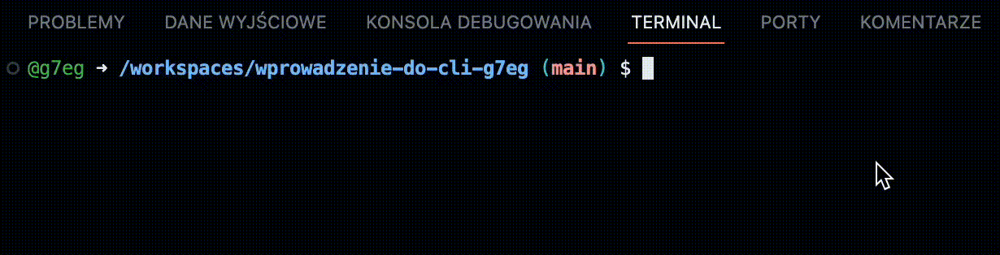 -->

[!WARNING] UWAGA!!!
Bardzo prawdopobne że zdaży Ci się wpisać w konsoli polecenie *cd* bez żadnych dostakowych argumentów. Spowoduje to przejście do katalogu głównego naszego systemu operacyjnego. Po wywołaniu polecenie *ls* wyświetlone zostaną wszystkie katalogi systemowe. Spowoduje to zapewne spory dyskomfort i konsternację. W takim wypadku należy przejść do katalogu w którym będziemy wcześniej pracowaliśmy. Dokonujemt tego w naszym przpadku za pomocą polecenie *cd /workspaces/Wprowadzenie_do_CLI*.
## pwd - wyświetl ścieżkę do obecnego katalogu
pwd - print working directory 
```bash
pwd
```
Jak widać na screenie poniżej została wyprintowana ścieżka do obecnego katalogu.

<!-- 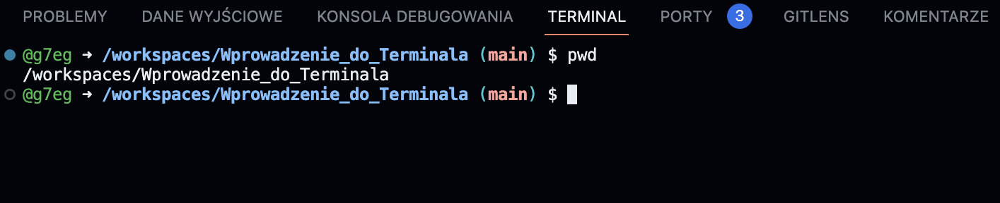 -->
<!--  -->
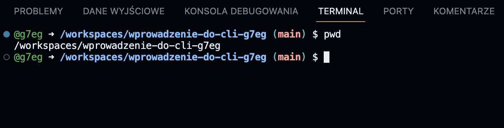

## tree - wyświetl strukturę katalogu
tree - print the tree sctructure of directory
```bash
tree
```
Pozwala wyświetlić strukturę katalogu w którym obecnie się znajdujemy.
<!-- 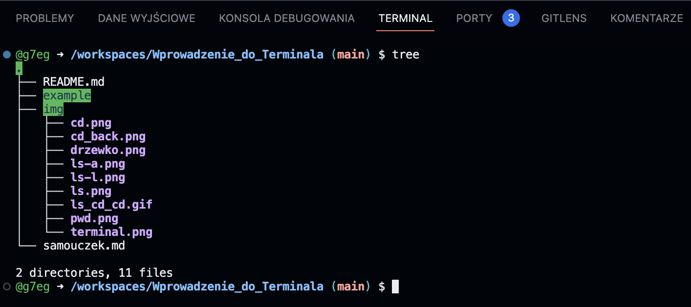 -->
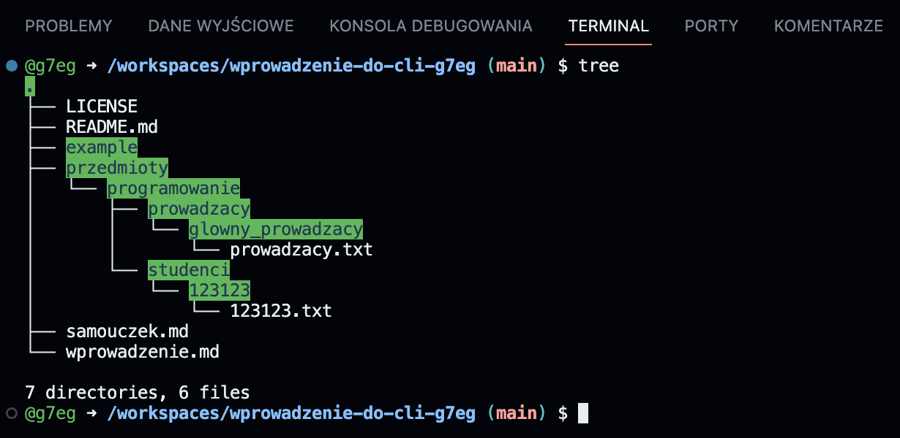
<!--  -->
## touch - tworzy nowy pusty plik
touch - pozwala utworzyć nowy pusty plik.
Polecenie touch tworzy domyślnie plik w miejscu gdzie się aktualnie znajdujemy.
Podając jednak ścieżkę wraz z nazwą pliku do miejsca gdzie chcemy utworzyć plik nie ma konieczności przechodzenia tam za pomocą polecenie cd.
```bash
touch plik_1.txt
```
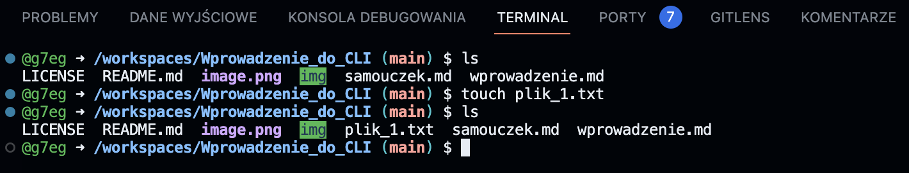
## mkdir - utwórz nowy katalog
mkdir - make directory

Tworzy nowy katalog.

Po poleceniu mkdir należy podać nazwę tworzonego katlogu, np:
```bash
mkdir nowyFolder
```
<!-- 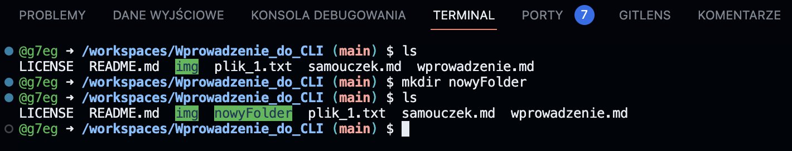
 -->
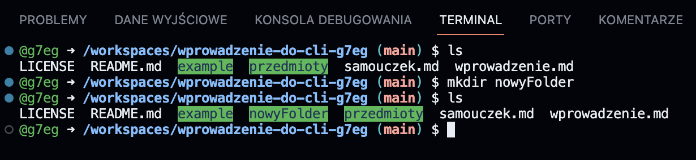

## mv - przenieś plik, przenieś katalog z zawartością, zmień nazwę pliku
mv - move
Polcenie mv pozwala przenieść plik z katalogu do innego katalogu. Pozwala różnież przenisć cały katalog wraz z jego zawartością w inne miejsce. Polcenie mv pozwala również w szybki sposób zamienić nazwy plików.
### Przenieś plik:
```bash
mv plik_1.txt nowyFolder/ 
```
<!-- 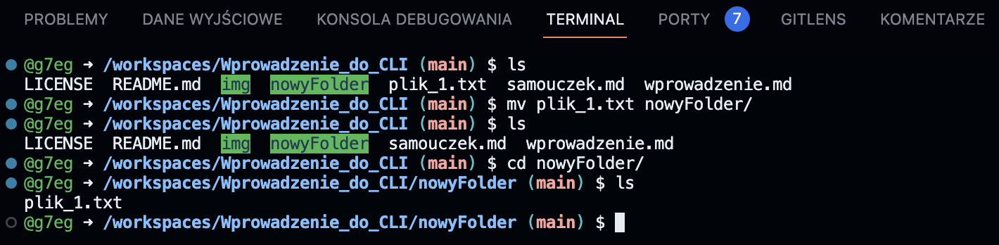
 -->
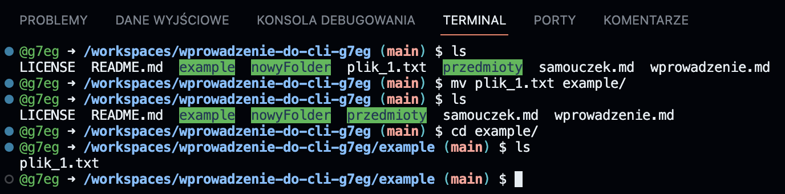

### Przenieś katalog:
```bash
mv nowyFolder/ kolejnyFolder/ 
```
<!-- 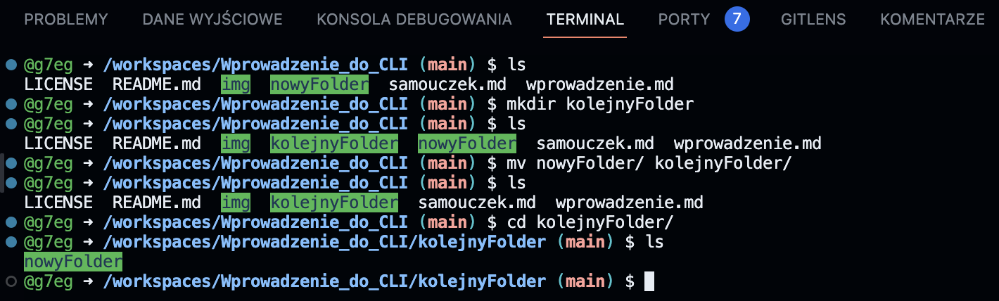
 -->
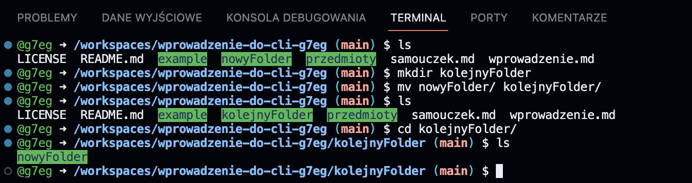

### Zmiana nazwy pliku:
```bash
mv plik_1.txt plik_2.txt 
```
Tak naprawdę tworzy nowy plik o nowej nazwie, kopiuje jego zawartość, a następnie usuwa stary plik:

<!-- 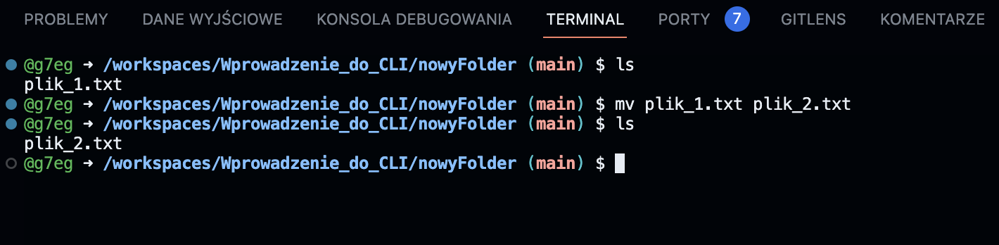
 -->
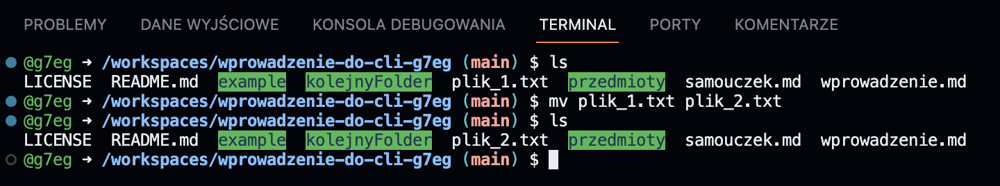

## cp - kopiuj plik lub katalog wraz z zawartością
### Kopiowanie pliku:
W celu wykonania kopii pliku należy skorzytać z polecenia _cp_. W poleceniu tym po spacji podaje się ścieżkę do pliku kopiowanego, a nastepnie rownież po spacji scieżke do miejsca docelowego.

W przypadku wykonywania kopii w folderze w ktorym się znajdujemy należy podać nazwę pliku kopiowanego, a następnie nazwe pliku który będzie kopią.
Przykład:

```bash
cp plik1.txt plik2.txt
```

<!--  -->
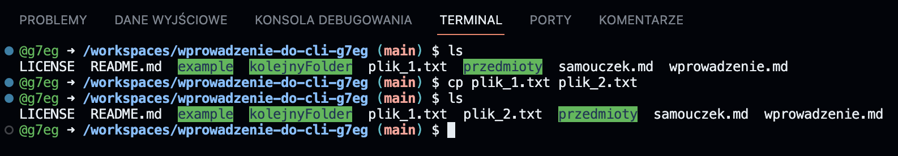
Moliwe jest wykonywanie kopii do dango miejsca w innym katalogu niz się obecnie znajdujemy.
```bash
cp plik1.txt ./example/plik3.txt
```
### Kopiowanie katalogów wraz z ich zawartością:
Polecenie _cp_ umożliwia rownież kopiowanie całych katalogów wraz z zawartością (całych struktur katalogów).


W tym celu należy jednak zmodyfikować lekko w/w polecenie dodając parametr _-r_ do polecenia _cp_. Na screenie poniżej pokazano komunikat błędu gdy zapomnimy o parametrze -r w poleceniu.

```bash
cp -r /example /example_copy
```
<!--  -->
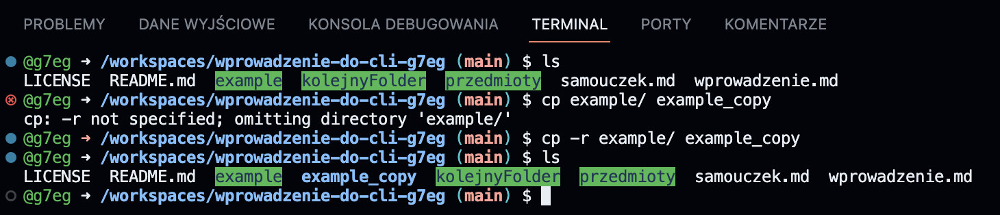

> [!Importatnt]
> Polecenie _cp_ nie kopiuje zawartości katalogów, w tym celu należy wykorystać polecenie z parametrem _-r_ jak opisano to wyżej.

## rm - usuń plik lub katalog
### Usunięcie pliku:
```bash
rm plik_1.txt
```
<!-- 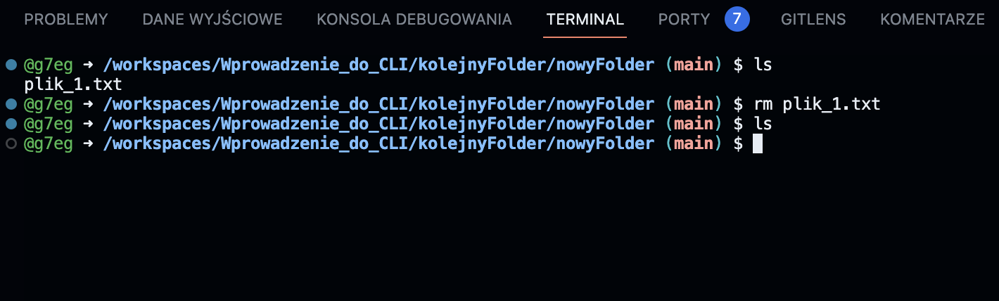
 -->
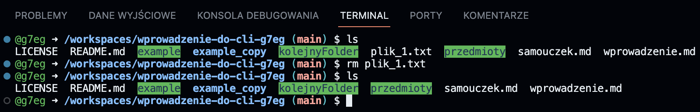
### Usunięcie katalogu wraz z jego zawartością:
Do usunięcia katalogu waraz z jego zawatością należy użyć dodatkowej rozszeżonego polecenia.
Takie rozszerzenie nazywane jest opcją.
W tym przypadku plecenie będzie wyglądało następująco:

```bash
rm -R nowyFolder
```

<!-- 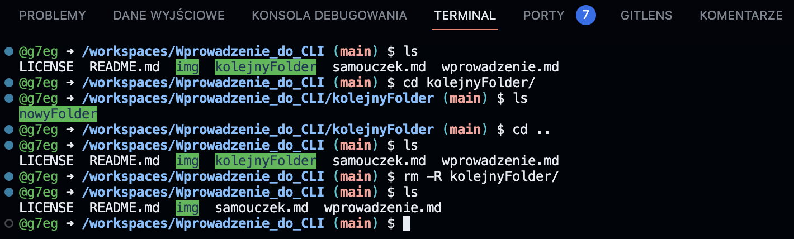 -->
<!--  -->
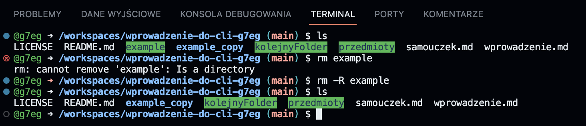

## clear - wyczyść okno terminalu
Pozwolę sobie nie komentować tego polecenia, przetestuj je samodzielnie 😌.
#### Poleceń jest zdecydowanie więcej, z tego względu polecam samodzielie zgłębić widzę na ich temat. Możesz to zrobić odwiedzajac stronę z dokumentacją [LINK](https://www.gnu.org/savannah-checkouts/gnu/bash/manual/bash.html)

# Dodatkowe komendy która będą nam potrzebne

## code - otwiera edycję pliku w VSCode
Wymaganiem jest to by VSCode był zaisntalowany na komputerze a zmięnne środowiskowe były poprawnie skonfigurowane (zazwyczaj dzieje się to automatycznie podczas instalacji VSCode).

Cała komenda składa się z polecenia 'code' oraz nazwy pliku który chcemy otworzyć.
```bash
code plik_1.txt
```
W przypadku gdy plik o danej nazwie nie istnieje, a możemy to sprawdzić wywoułąc wcześniej polcenie 'ls'. Plik ten zostanie utworzony.

Zauważ że w w/w przykładzie, plik_1.txt znajduje się katalogu w którym obecnie się znajdujemy. Jednak zamiast pliku można podać ścieżkę do pliku, bez konieczności przechodzenia do tego katalogu.
```bash
code nowyFolder/plik_1.txt
```
<!-- 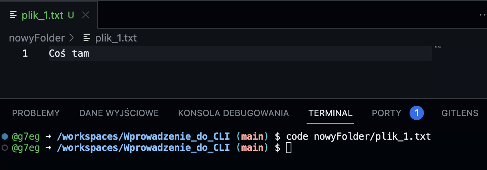
 -->
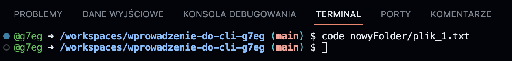


# Wyposażeni w podstawową wiedzę możemy rozpocząć praktyczną przygodę!
Zapraszam więc do praktyki i realizacji zadań z 
[samouczka](./samouczek.md)
