# 🔵 Wprowadzenie do poleceń - bash
Poniżej zostały opisane polecenie pozwalające w postawowym zakresie dokonać operacji na plikach i katalogach za pomocą CLI.


## Zanim rozpoczniemy pracę:
Na samym początku należy uruchomić środowisko Codespace logując się przy tym na swoje konto GitHub.

Po jego uruchmieniu upewnij się że w dolnej części okna przeglądarki znajduje się Terminal.

Jeżeli go nie widzisz z menu wybierz ikonę <b> ≡ (ikona menu hamburgera)</b> -> terminal -> nowy terminal.

Powinieneś zauważyć w oknie terminalu który otowrzy się w dolnej części ekranu, coś podobnego do:


Najważniejszy w tym wszystkim jest znak '$' nazywany znakiem zachęty.

Oznacza to że wszystko zostało uruchomione poprawnie i możemy przystąpić do dalszej pracy!

Wszystkie polecenia będzie wpisywać po znaku zachęty.

# 🟢 Podstawowe polecenia bash - wprowadzenie
Tutaj opisanych zostało kilka podstawowych poleceń, które są niezbędnę do poruszania się po katalogach i plikach na naszym komputerze oraz wykonywania podstawowych operacji na nich. Tak zdaję sobie sprawę że jesteś przyzyczajony do pracy z GUI i najchętniej zamknął byś to wszystko i [...] Jednak pocieszę Cię, bo nie jesteś jedyną osobą, która na poczatku przygody z CLI miała takie odczucia. Najtrudniejsze jest zmiana swojego negatywnego nastawienia i przełamenie przekonań że to trudne. Zobaczysz że wraz z praktyką przyjdzie satysfakcja!

## ls - wyświetl zawartość katalogu
ls - list. Wpisanie tego polecenia w takiej formie:
```bash
ls
```
Wyświetli nam listę elementów znadujących się w katalogu w którym się obecnie znajdujemy.

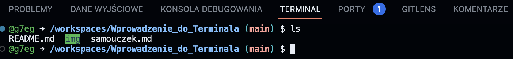
Te same informacje możesz znaleźć w GUI - eksploratorze plików. Jednak o GUI na chwilę zapominamy.

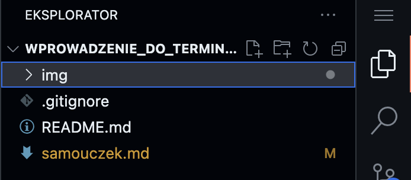

Polecenie ls możemy wywołac jeszcze z pewnymi parametrami.
Najważniejszymi i naczęściej wykorzystywanymi są:

```bash
ls -a
```
Pozwala wyświetlić wszystkie ukryte pliki w katalogu.

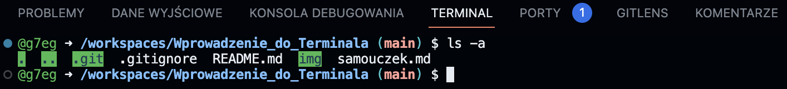

```bash
ls -l
```
Pozwala wyświetlić listę plików z bardziej szczegółowym opisem.


## cd - przejdź do katalogu
change directory - Pozwala przejść do katalogu.
Podajemy polecenie cd a następnie folder do którego chcemy przejść.
```bash
cd example
```
W przykładze wywołano wczesniej ls w celu wylistowania dostępnych plików i katalogów. Następnie podano polcenie zmiany katalogu cd i nazwę katalogu.

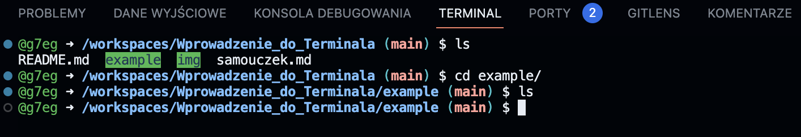

#### TIP!
___
Podczas wpisywania np nazwy katalogu nie musisz wpisać jej w całości. Wystarczy że wpiszesz pierwszą literę katalogu (np. e jak katalog example) i naciśniesz klawisz TAB (tabulator). Terminal sam uzupełni nazwę katalogu. 

Jeżeli katalogów jest więcej zaczynających swją nazwę od 'e', terminal wświetli ponownie listę katalogów, które spałniają to kryterium. Wprowadzając kolejną literę i ponownie wciskając klawisz TAB nazwa zostanie uzupełniona automatycznie.

Wiemy już jakprzechodzić z katalogu do kolejnego katalogu.
Natomiast co jeżeli popełnimy błąd i chcemy powrócić do wcześneijszego katalogu?

W takiej sytuacji możemy wykorzystać również polcenie cd ale z dwoma znakmami '..'
```bash
cd ..
```
Zauważ że w przykładzie poniżej przed wywołaniem polcenie '*cd ..*' znajdowaliśmy się w katalogu example.
Po wywołaniu wróciliśmy do poprzedniego katalogu.

[?] Dlaczego po zmiany katalogu na *'example'* i wywołaniu polecenie *ls* nic się nie pojawiło?

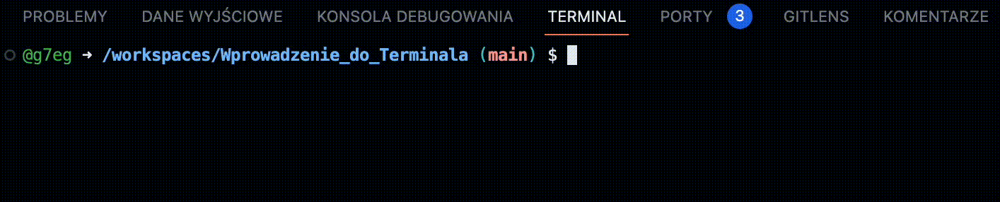
## pwd - wyświetl ścieżkę do obecnego katalogu
pwd - print working directory 
```bash
pwd
```
Jak widać na screenie poniżej została wyprintowana ścieżka do obecnego katalogu.

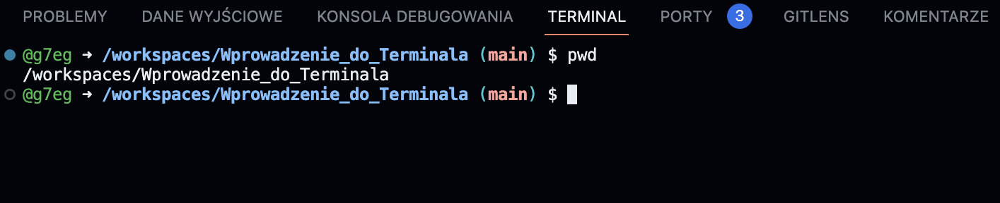
## tree - wyświetl strukturę katalogu
tree - print the tree sctructure of directory
```bash
tree
```
Pozwala wyświetlić strukturę katalogu w którym obecnie się znajdujemy.
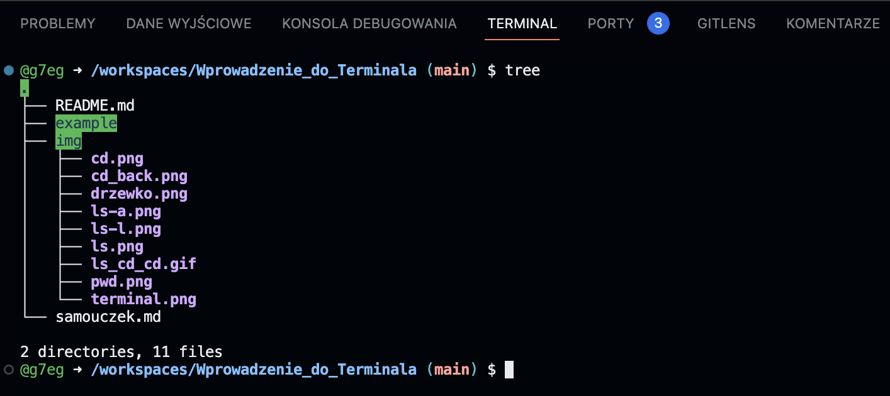
## touch - tworzy nowy pusty plik
touch - pozwala utworzyć nowy pusty plik.
Polecenie touch tworzy domyślnie plik w miejscu gdzie się aktualnie znajdujemy.
Podając jednak ścieżkę wraz z nazwą pliku do miejsca gdzie chcemy utworzyć plik nie ma konieczności przechodzenia tam za pomocą polecenie cd.
```bash
touch plik_1.txt
```
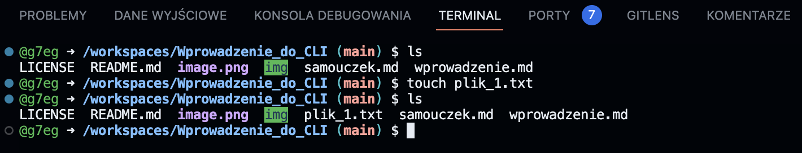
## mkdir - utwórz nowy katalog
mkdir - make directory

Tworzy nowy katalog.

Po poleceniu mkdir należy podać nazwę tworzonego katlogu, np:
```bash
mkdir nowyFolder
```
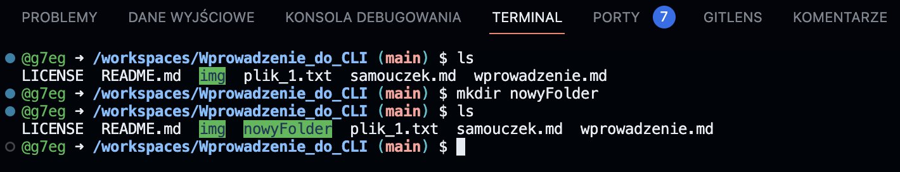
## mv - przenieś plik, przenieś katalog z zawartością, zmień nazwę pliku
mv - move
Polcenie mv pozwala przenieść plik z katalogu do innego katalogu. Pozwala różnież przenisć cały katalog wraz z jego zawartością w inne miejsce. Polcenie mv pozwala również w szybki sposób zamienić nazwy plików.
### Przenieś plik:
```bash
mv plik_1.txt nowyFolder/ 
```
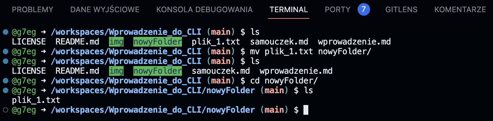

### Przenieś katalog:
```bash
mv nowyFolder/ kolejnyFolder/ 
```
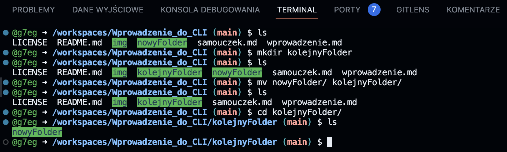

### Zmiana nazwy pliku:
```bash
mv plik_1.txt plik_2.txt 
```
Tak naprawdę tworzy nowy plik o nowej nazwie, kopiuje jego zawartpść a następnie usuwa stary plik:

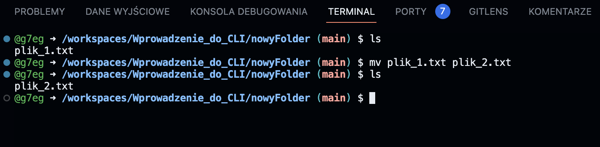

## rm - usuń plik lub katalog
### Usunięcie pliku:
```bash
rm plik_1.txt
```
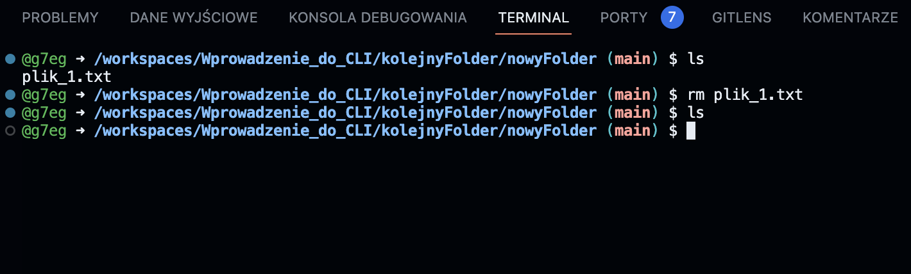
### Usunięcie katalogu wraz z jego zawartością:
Do usunięcia katalogu waraz z jego zawatością należy użyć dodatkowej rozszeżonego polecenia.
Takie rozszerzenie nazywane jest opcją.
W tym przypadku plecenie będzie wyglądało następująco:
```bash
rm -R nowyFolder
```
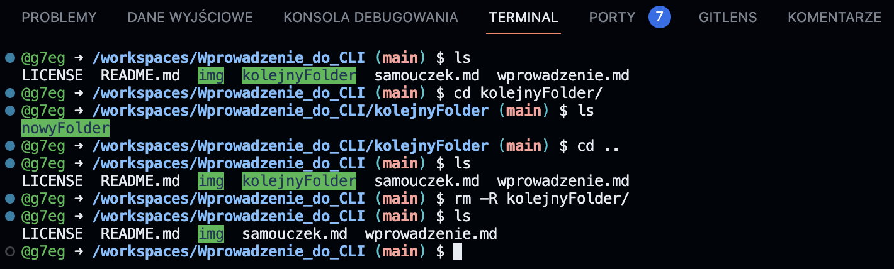

## clear - wyczyść okno terminalu
# Dodatkowe komendy

## code - otwiera edycję pliku w VSCode - jeśtli jest zainstalowny

## Wyposażeni w podstawową wiedzę możemy rozpocząć praktyczną przygodę!
Zapraszam do 
[samouczeka](./samouczek.md)
